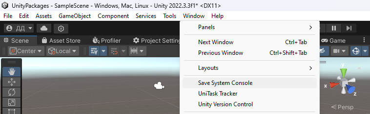

# In editor

In the unity editor there is a button for remove data

It is active only when there is the data. After you remove
the data, the button will be disabled.

Also Save System menu contains Get Data Size button. It
writing size of your data files in debug console

