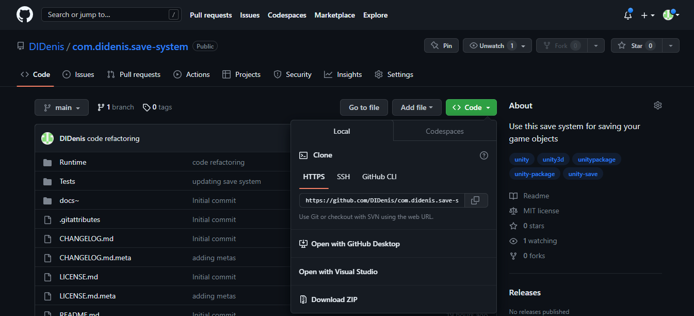
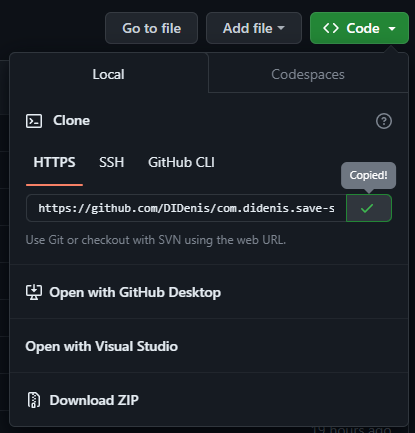
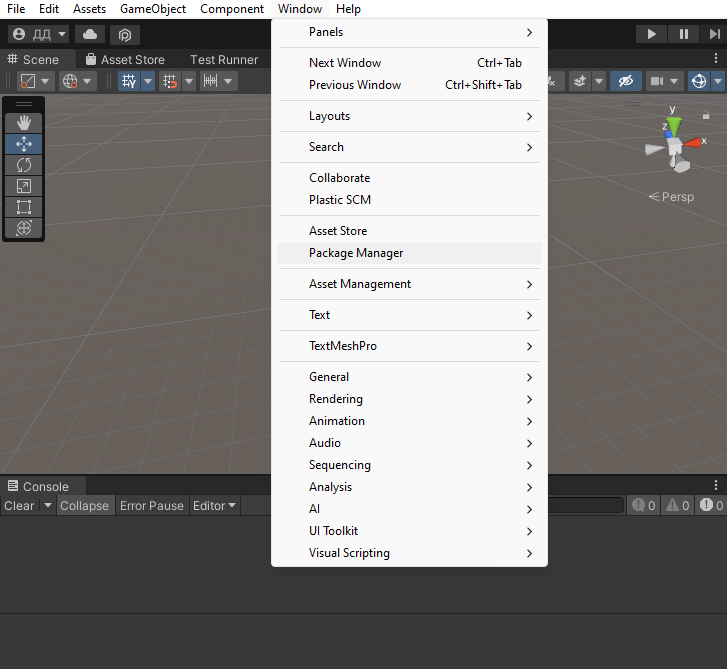
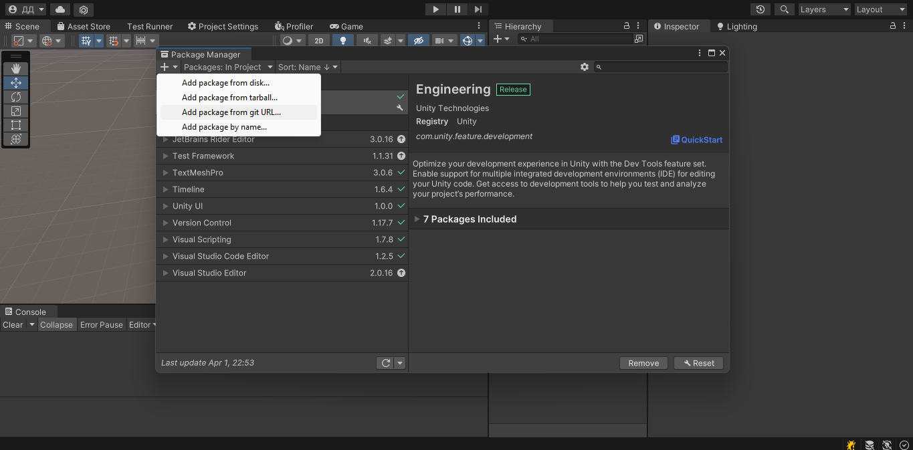
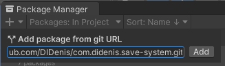
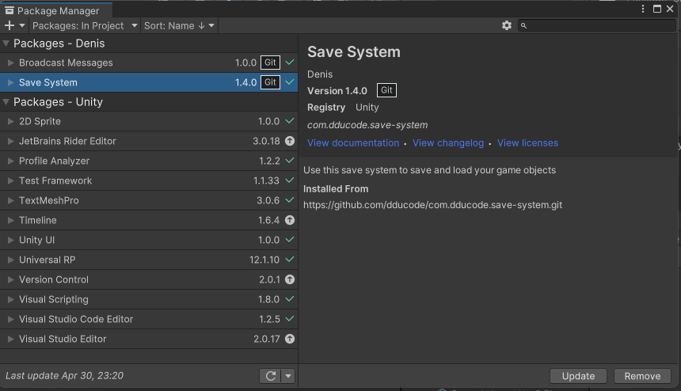

# Installing

Do these steps to install the package:

1. Click on the green button "Code"

   

2. Then click on copy button, in "HTTPS" tab 

    

3. In Unity open the Package Manager window (Window/Package Manager)

    

4. Then click on plus sign and select "Add package from git URL"

    

5. Insert copied link and click on "Add"

    

6. After a while the package will be added to your project

    