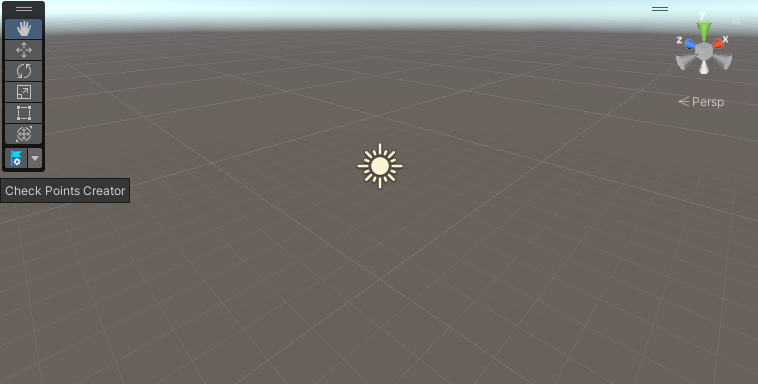
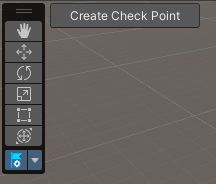
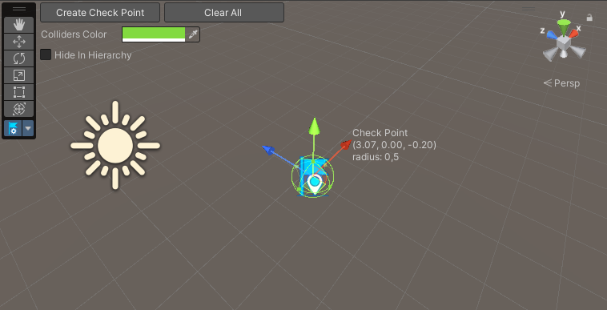
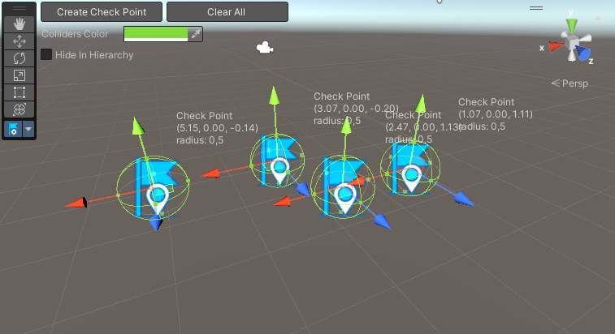

# Checkpoints

Sometimes we need saving the player progress at some physical
point. You can create such points in the editor or at runtime.

## Creating checkpoints in the editor

In the scene view in the toolbar you can see Check Points Creator
tool



Click on this or tap "C" button on keyboard and the tool will
activate. In the upper left corner there is a Create Check Point button 



When you create your first checkpoint, also other buttons
will be displayed in the view



The tool supports multiply points editing



## In code

There are 2 commands to quickly create checkpoints at runtime

```csharp
CheckPointsFactory.CreateCheckPoint(Vector3 position, float radius = 0.5f);
CheckPointsFactory.CreateCheckPoint2D(Vector2 position, float radius = 0.5f);
```